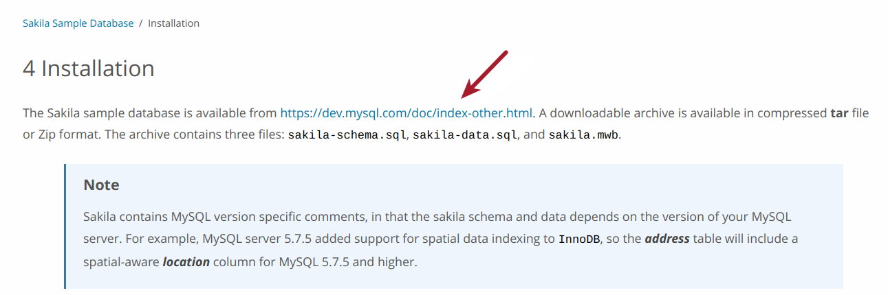
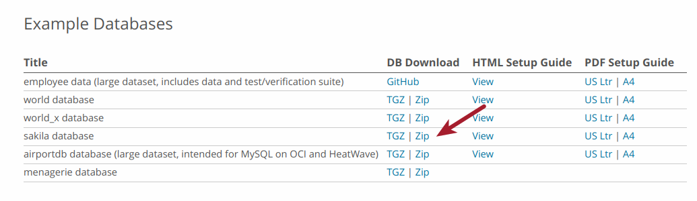

# Base de Dados Sakila

Este roteiro prático detalha a base de dados Sakila disponibilizada pelo MySQL, que inclui  _schema_ e dados de uma loja de aluguel de DVDs.

Para uso, basta seguir os passos descritos no [guia de instalação](https://dev.mysql.com/doc/sakila/en/sakila-installation.html). Basicamente, você precisa criar o banco usando o script `sakila-schema.sql`. Em seguida, você deve inserir os dados usando o script `sakila-data.sql`.

O link para acessar os [scripts](https://dev.mysql.com/doc/index-other.html) está disponível na página, conforme mostrado na imagem a seguir. 

Para dowload dos scripts, selecione a opção `sakila database` no menu `Example Databases`. 

O material inclui também detalhes sobre o modelo ER e exemplos de consultas.

Alguns livros também baseiam-se nesta base de dados, provendo exemplos de consultas. O livro [Learning SQL](https://www.oreilly.com/library/view/learning-sql-3rd/9781492057604/), por exemplo, inclui nos apêndices uma série de exercícios com respostas.

## Referências

Alan Beaulieu. [Learning SQL](https://www.oreilly.com/library/view/learning-sql-3rd/9781492057604/). 3ed, 2020.

[Sakila Sample Database](https://dev.mysql.com/doc/sakila/en/sakila-introduction.html). MySQL. Acesso em Maio, 2023.
